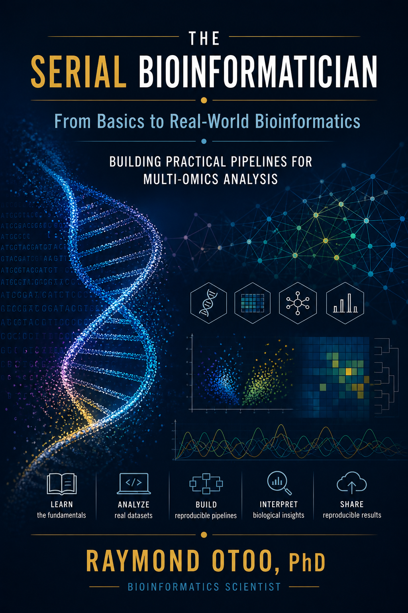

# The Serial Bioinformatics

<p align="center">
  
</p>

A comprehensive guide from the central dogma to cutting-edge computational techniques in bioinformatics.

---

## Book Structure & Table of Contents

This book is structured to guide the reader from the fundamental principles of molecular biology to the practical application of bioinformatics tools and algorithms.

### Part 1: The Biological Foundation

*   [**Chapter 1: Introduction to the Central Dogma**](chapter-01/chapter.md)
    *   What is Bioinformatics?
    *   DNA: The Blueprint of Life
    *   Transcription: From DNA to RNA
    *   Translation: From RNA to Protein

*   [**Chapter 2: The Genome and its Variations**](chapter-02/chapter.md)
    *   DNA Structure and Replication
    *   Genes and Chromosomes
    *   Genetic Variation: SNPs, Indels, and Structural Variants

*   [**Chapter 3: Proteins - The Functional Units**](chapter-03/chapter.md)
    *   Amino Acids and Protein Structure (Primary, Secondary, Tertiary, Quaternary)
    *   Protein Function and Families

### Part 2: Foundational Computational Skills

*   [**Chapter 4: Introduction to the Command Line for Biologists**](chapter-04/chapter.md)
*   [**Chapter 5: Programming for Bioinformatics with Python**](chapter-05/chapter.md)
*   [**Chapter 6: Navigating Biological Databases (NCBI, Ensembl, UniProt)**](chapter-06/chapter.md)

### Part 3: Core Bioinformatics Analysis

*   [**Chapter 7: Sequence Alignment**](chapter-07/chapter.md)
*   [**Chapter 8: Phylogenetics: Understanding Evolutionary Relationships**](chapter-08/chapter.md)
*   [**Chapter 9: Genome Assembly and Annotation**](chapter-09/chapter.md)

### Part 4: High-Throughput "Omics"

*   [**Chapter 10: Introduction to Next-Generation Sequencing (NGS)**](chapter-10/chapter.md)
*   [**Chapter 11: Transcriptomics: Analyzing Gene Expression (RNA-Seq)**](chapter-11/chapter.md)
*   [**Chapter 12: Proteomics and Metabolomics**](chapter-12/chapter.md)
*   [**Chapter 13: Microbiomics: Analyzing Microbial Communities (16S rRNA & QIIME 2)**](chapter-13/chapter.md)

### Part 5: Advanced Topics and Applications

*   [**Chapter 14: Structural Bioinformatics**](chapter-14/chapter.md)
*   [**Chapter 15: Systems Biology: Integrating the 'Omics'**](chapter-15/chapter.md)
*   [**Chapter 16: Bioinformatics in Medicine**](chapter-16/chapter.md)

---

### Appendices

*   [**Glossary of Terms**](GLOSSARY.md)

---

## Building the Book Locally

To read this book on your own computer or to check your changes before contributing:

1.  **Install Dependencies:**
    ```bash
    pip3 install -r requirements.txt
    ```
2.  **Run the Server:**
    ```bash
    python3 -m mkdocs serve
    ```
3.  **View:** Open your browser to `http://127.0.0.1:8000`.
