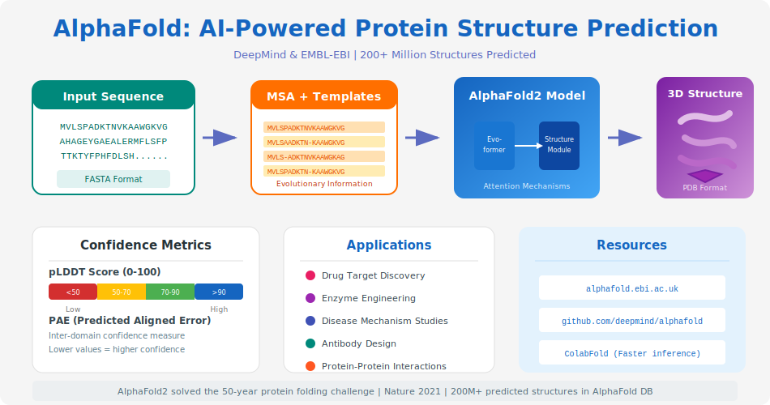

# Chapter 3: Proteins - The Functional Units


<div class="download-slides">
📥 <a href="../slides/chapter-03.pptx" download>Download Lecture Slides (PPTX)</a>
</div>

We have explored the blueprint (DNA) and the messenger (RNA). Now, we arrive at the machines that actually do the work: **Proteins**.

If DNA is the architectural drawing of a building, proteins are the bricks, the cement, the windows, and the construction workers themselves. In this chapter, we will understand how a simple string of letters becomes a complex, functional 3D machine.

## 3.1 Amino Acids: The Building Blocks

Just as DNA is a polymer made of nucleotides (A, T, C, G), proteins are polymers made of **Amino Acids**.

There are **20 standard amino acids** found in nature. You can think of them as a set of 20 different Lego bricks. Each one has a unique chemical personality:
*   **Hydrophobic:** "Water-fearing" (oily). These tend to bury themselves inside the protein to get away from water.
*   **Hydrophilic:** "Water-loving". These tend to stay on the outside, interacting with the cell's watery environment.
*   **Charged:** Positive or Negative. These act like magnets, attracting or repelling other parts of the protein.

The specific sequence of these amino acids determines everything about the protein.

---

## 3.2 The Hierarchy of Protein Structure

<p align="center">
    
</p>

## 3.4 Structure Prediction and Modern Tools

Recent advances in deep learning have transformed structural bioinformatics. Methods such as **AlphaFold** produce highly accurate 3D predictions from sequence alone, helping researchers generate testable hypotheses and guide experiments.

- **AlphaFold / RoseTTAFold:** Accurate structure predictions; useful for annotation, variant interpretation, and modeling complexes.
- **Cryo-EM and experimental methods:** The explosion of cryo-EM structures complements computational predictions and provides high-resolution validation.
- **Visualization & downstream tools:** Use `PyMOL`, `ChimeraX`, or web-based viewers to inspect models; consider molecular dynamics for refinement when necessary.

Here is a compact workflow:

1.  Obtain sequence(s) of interest.
2.  Run or query AlphaFold models (or use local prediction tools where available).
3.  Visualize predicted structures and compare to experimental PDB entries.
4.  Use structure-aware annotations to infer active sites, binding pockets, or variant effects.

An illustrative diagram is available: 

<p align="center">
    
</p>

A protein isn't just a floppy string; it folds into a precise shape. We describe this shape in four levels:

### 1. Primary Structure (The Sequence)
This is simply the linear order of amino acids in the chain.
*   *Example:* `Met-Ala-Ser-Glu...`

### 2. Secondary Structure (Local Folding)
As the chain forms, local interactions (hydrogen bonds) cause it to twist and bend into stable patterns.
*   **Alpha Helix:** A spiral shape, like a coiled telephone cord.
*   **Beta Sheet:** A flat, pleated shape, like a folded paper fan.

### 3. Tertiary Structure (3D Shape)
This is the overall 3D shape of the entire protein molecule. The hydrophobic parts hide in the center, and the charged parts interact, locking the protein into a specific "globular" shape.

### 4. Quaternary Structure (Complexes)
Some proteins are made of multiple separate chains that come together to form a team.
*   *Example:* **Hemoglobin** (which carries oxygen in your blood) is made of four separate protein subunits working together.

---

## 3.3 Protein Function and Families

In biology, **Structure determines Function**.

*   **Enzymes:** Have a specific pocket (active site) shaped perfectly to hold a molecule and react with it (Lock and Key model).
*   **Structural Proteins:** Form long, strong fibers (like Collagen in your skin).
*   **Signal Proteins:** Have shapes that fit perfectly into receptors on the outside of cells to transmit messages (like Insulin).

### Protein Families
Evolution is lazy. If nature invents a useful protein shape, it reuses it. Proteins with similar sequences usually adopt similar structures and perform similar functions. We group these into **families**. If you find a new gene that looks like a known "Kinase" family gene, you can predict that your new protein is likely a Kinase too.

---

## 3.4 Bioinformatics in Action: Translation

In Chapter 1, we transcribed DNA to RNA. Now, let's write a Python script to **translate** that RNA into a Protein sequence.

To do this, we need a **Codon Table** (the dictionary mapping 3 RNA letters to 1 Amino Acid).

```python
def translate_rna_to_protein(rna_sequence):
    """Translates an RNA sequence into a Protein sequence."""
    
    # The Genetic Code Dictionary
    codon_table = {
        'UUU': 'F', 'UUC': 'F', 'UUA': 'L', 'UUG': 'L',
        'UCU': 'S', 'UCC': 'S', 'UCA': 'S', 'UCG': 'S',
        'UAU': 'Y', 'UAC': 'Y', 'UAA': '_', 'UAG': '_', # _ = Stop
        'UGU': 'C', 'UGC': 'C', 'UGA': '_', 'UGG': 'W',
        'CUU': 'L', 'CUC': 'L', 'CUA': 'L', 'CUG': 'L',
        'CCU': 'P', 'CCC': 'P', 'CCA': 'P', 'CCG': 'P',
        'CAU': 'H', 'CAC': 'H', 'CAA': 'Q', 'CAG': 'Q',
        'CGU': 'R', 'CGC': 'R', 'CGA': 'R', 'CGG': 'R',
        'AUU': 'I', 'AUC': 'I', 'AUA': 'I', 'AUG': 'M', # M = Start
        'ACU': 'T', 'ACC': 'T', 'ACA': 'T', 'ACG': 'T',
        'AAU': 'N', 'AAC': 'N', 'AAA': 'K', 'AAG': 'K',
        'AGU': 'S', 'AGC': 'S', 'AGA': 'R', 'AGG': 'R',
        'GUU': 'V', 'GUC': 'V', 'GUA': 'V', 'GUG': 'V',
        'GCU': 'A', 'GCC': 'A', 'GCA': 'A', 'GCG': 'A',
        'GAU': 'D', 'GAC': 'D', 'GAA': 'E', 'GAG': 'E',
        'GGU': 'G', 'GGC': 'G', 'GGA': 'G', 'GGG': 'G',
    }

    protein = ""
    rna_sequence = rna_sequence.upper()

    # Loop through the sequence in steps of 3
    for i in range(0, len(rna_sequence), 3):
        codon = rna_sequence[i:i+3]
        
        # Check if we have a full 3-letter codon
        if len(codon) == 3:
            amino_acid = codon_table.get(codon, 'X') # X for unknown
            
            if amino_acid == '_': # Stop codon
                break # Stop translating
            
            protein += amino_acid
            
    return protein

# Example Usage
# This is a short RNA sequence
my_rna = "AUGGCCAUGGCGCCCUAA" 

protein_seq = translate_rna_to_protein(my_rna)

print(f"RNA:     {my_rna}")
print(f"Protein: {protein_seq}")
```

**Output:**
```text
RNA:     AUGGCCAUGGCGCCCUAA
Protein: MAMAP
```
*(Note: 'M' is Methionine, 'A' is Alanine, 'P' is Proline. The translation stops at 'UAA'.)*