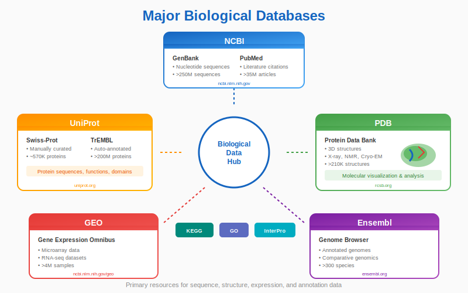

# Chapter 6: Navigating Biological Databases


<div class="download-slides">
📥 <a href="../slides/chapter-06.pptx" download>Download Lecture Slides (PPTX)</a>
</div>

## 6.1 The Data Deluge

Biology has transformed into a data-rich science. Experiments now generate terabytes of data daily. This data is stored in massive, centralized repositories. As a bioinformatician, knowing how to navigate these databases is as important as knowing how to code.

## 6.2 The Big Three

<p align="center">
  
</p>

While there are thousands of specialized databases, three major organizations host the primary data for the world:

1.  **NCBI (National Center for Biotechnology Information):** Based in the USA. Home to **GenBank** (nucleotide sequences) and **PubMed** (scientific literature).
2.  **EMBL-EBI (European Bioinformatics Institute):** Based in the UK. Home to **Ensembl** (genome browser).
3.  **DDBJ (DNA Data Bank of Japan):** Based in Japan.

These three exchange data daily, so a sequence submitted to one will eventually appear in all three.

## 6.3 Key Databases

### GenBank (Nucleotides)
An annotated collection of all publicly available DNA sequences.

### UniProt (Proteins)
The gold standard for protein data.
*   **Swiss-Prot:** Manually annotated and reviewed (High quality).
*   **TrEMBL:** Automatically annotated (High quantity, lower confidence).

### Ensembl
A genome browser focused on chordates (humans, mice, etc.). It is excellent for visualizing genes in the context of chromosomes and seeing variants (SNPs).

## 6.4 Accession Numbers: The ID Cards

Every record in a database has a unique identifier called an **Accession Number**. These are stable over time.

*   **NM_000546:** NCBI RefSeq mRNA.
*   **NP_000537:** NCBI RefSeq Protein.
*   **P53_HUMAN:** UniProt ID.

## 6.5 Bioinformatics in Action: Fetching Data with Python

You don't need to visit the website to get data. You can use Biopython's `Entrez` module to fetch data programmatically.

*Note: Always provide your email to NCBI so they can contact you if your script causes issues.*

```python
from Bio import Entrez

# 1. Tell NCBI who you are
Entrez.email = "your.email@example.com"

# 2. Fetch a record (e.g., Nucleotide database, ID = NM_000546 for TP53)
# rettype="gb" means GenBank format, retmode="text" means plain text
handle = Entrez.efetch(db="nucleotide", id="NM_000546", rettype="gb", retmode="text")

# 3. Read the data
record_data = handle.read()
handle.close()

print(record_data[:500]) # Print the first 500 characters
```

**Output (Snippet):**
```text
LOCUS       NM_000546               2591 bp    mRNA    linear   PRI 02-APR-2023
DEFINITION  Homo sapiens tumor protein p53 (TP53), transcript variant 1, mRNA.
ACCESSION   NM_000546
VERSION     NM_000546.6
SOURCE      Homo sapiens (human)
...
```

## Summary

Databases are the libraries of bioinformatics. We use **Accession Numbers** to locate specific books (records) and tools like **Entrez** to check them out automatically.

## 6.6 Programmatic Access, APIs, and Standards

Beyond `Entrez`, programmatic access to data is critical for automation and reproducible research.

- **ENA / EBI APIs:** The European Nucleotide Archive provides REST endpoints for searching and fetching datasets (use `curl` or `requests`).

  Example (fetch a metadata JSON):

  ```bash
  curl -H "Accept: application/json" "https://www.ebi.ac.uk/ena/portal/api/filereport?accession=SRR1234567&result=read_run&fields=run_accession,fastq_ftp"
  ```

- **GA4GH standards:** Emerging standards such as `htsget` and `refget` enable secure, standardized access to sequencing reads and reference sequences across cloud providers.
- **Rate limiting & attribution:** Always include contact information when scripting large downloads and respect provider rate limits. Use `MultiQC` and logging to collect provenance information.

Programmatic access enables reproducible pipelines: combine APIs, `snakemake`, and containers to fetch data, process it, and archive outputs with clear provenance.