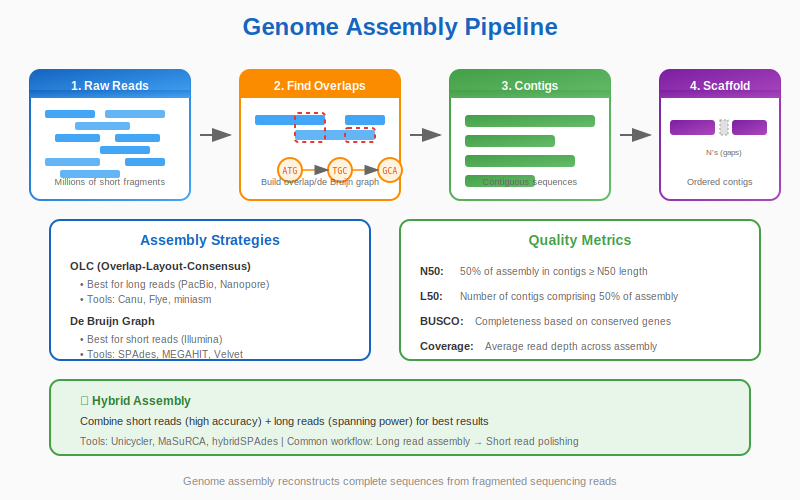

# Chapter 10: Genome Assembly and Annotation


<div class="download-slides">
📥 <a href="../slides/chapter-09.pptx" download>Download Lecture Slides (PPTX)</a>
</div>

## 10.1 The Jigsaw Puzzle

<p align="center">
</p>
<p align="center">
  
</p>
</p>

When we sequence a genome, we do not read the chromosome from start to finish. Current technology cannot do that. Instead, we break the DNA into millions of tiny pieces, sequence them, and then try to put them back together.

This is **Genome Assembly**.

Imagine shredding 100 copies of the *New York Times*, mixing them up, and trying to reconstruct the Sunday edition.

## 10.2 Key Concepts in Assembly

### Reads
The raw, short sequences that come off the machine (e.g., 150 letters long).

### Coverage (Depth)
The average number of times a specific base in the genome was sequenced.
*   If a genome is 100 bases long, and you have 3000 bases of data, you have **30x coverage**. Higher coverage gives higher confidence.

### Contigs and Scaffolds
1.  **Contig:** A continuous sequence formed by overlapping reads. (A completed puzzle section).
2.  **Scaffold:** Contigs connected by gaps of known length. (Knowing that the "Sports" section comes after "Business", even if you are missing the page in between).

### Repeats: The Villain
Genomes are full of repetitive sequences (e.g., `ATATAT...` for thousands of bases). If a read is shorter than the repeat, the assembler doesn't know where it belongs. This is the hardest part of assembly.

## 10.3 Assessing Quality: N50

How do we know if an assembly is "good"? We use a metric called **N50**.

Imagine lining up all your contigs from longest to shortest. Walk down the line until you have covered 50% of the total genome length. The length of the contig you are standing on is the N50.
*   **High N50** = Good (Long, continuous pieces).
*   **Low N50** = Bad (Fragmented, tiny pieces).

## 10.4 Genome Annotation

Once you have the sequence, you need to find the landmarks. **Annotation** is the process of identifying genes and features.

*   **Ab Initio:** Using algorithms to find "gene-like" patterns (Start codon ... ORF ... Stop codon).
*   **Homology-Based:** Aligning known proteins from other species to your new genome to find matches.

## 10.5 Bioinformatics in Action: Calculating N50

Let's write a function to calculate N50 from a list of contig lengths.

```python
def calculate_n50(contig_lengths):
    """Calculates the N50 metric for a list of contig lengths."""
    # 1. Sort lengths in descending order
    contig_lengths.sort(reverse=True)
    
    # 2. Calculate total genome size
    total_size = sum(contig_lengths)
    
    # 3. Find the threshold (50% of total size)
    threshold = total_size / 2
    
    # 4. Walk down the list
    current_sum = 0
    for length in contig_lengths:
        current_sum += length
        if current_sum >= threshold:
            return length
    return 0

# Example: A fragmented assembly
contigs = [100, 300, 500, 50, 20, 800] 
# Sorted: 800, 500, 300, 100, 50, 20. Total = 1770. Half = 885.
# 800 < 885
# 800 + 500 = 1300 (> 885). So N50 is 500.

n50_val = calculate_n50(contigs)
print(f"N50: {n50_val}")
```

**Output:**
```text
N50: 500
```

## Summary

Genome assembly stitches short reads into long **contigs**. We use metrics like **N50** to judge the quality. Finally, **annotation** turns the raw sequence into a map of genes and functions.

## 10.6 Modern Assembly: Long reads, hybrid approaches, and best practices

Recent advances in sequencing have shifted the assembly landscape. Long-read technologies (PacBio HiFi, Oxford Nanopore) produce reads that span many repeats and structural variants, making assemblies much more contiguous. Key recommendations:

- **Choose technology by goal:** Use short reads (Illumina) for high base accuracy and variant calling; use long reads for assembly and structural variant discovery. HiFi reads combine length with high accuracy.
- **Hybrid assembly:** Combine long reads for contiguity with short reads for polishing. Tools: `SPAdes` (hybrid modes), `Unicycler` (bacterial hybrid), `MaSuRCA`.
- **Long-read assemblers:** `hifiasm` (HiFi), `Flye`, `Canu`.
- **Polishing:** After assembly, improve base accuracy with short-read polishing tools (`Pilon`) or long-read polishers (`Racon`, `Medaka`). For HiFi assemblies, fewer polishing rounds are typically needed.
- **Scaffolding & phasing:** Use Hi-C, linked reads, or trio-binning to scaffold and phase haplotypes when producing reference-quality genomes.

## 10.7 Quality control and evaluation

Tools and metrics to include in any assembly workflow:

- **QUAST**: Comprehensive assembly evaluation (N50, misassemblies, genome fraction).
- **BUSCO**: Measures gene-space completeness using single-copy orthologs.
- **BlobTools**: Detect contamination by taxonomic assignment of contigs.

Practical tips:

- Target appropriate coverage: ~30–60× for long-read assembly depending on genome complexity; higher for polyploid or repeat-rich genomes.
- Keep raw data and intermediate files organized and versioned; record software versions and parameters for reproducibility.

## 10.8 Recommended minimal pipeline (example)

1.  Basecalling and adapter trimming (if required).
2.  Read QC and filtering (remove low-quality reads and contaminants).
3.  Assemble with a long-read assembler (or hybrid assembler when combining data).
4.  Polish the assembly with reads of complementary accuracy.
5.  Run QUAST and BUSCO to evaluate.
6.  Annotate using evidence-based pipelines (e.g., `MAKER`, `BRAKER`) and deposit raw reads and assembly in public archives (SRA, ENA) for transparency.

## 10.9 Further reading and resources

- The Genome Reference Consortium and recent high-quality assemblies (e.g., T2T consortium) provide important case studies in assembly best practices.
- Tool documentation: `hifiasm`, `Flye`, `SPAdes`, `QUAST`, `BUSCO`.