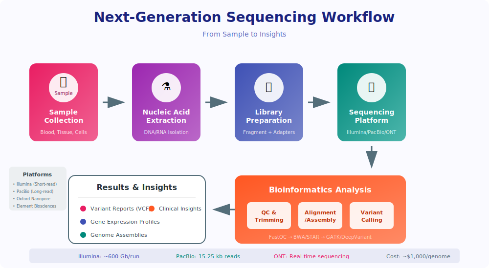

# Chapter 11: Introduction to Next-Generation Sequencing (NGS)


<div class="download-slides">
📥 <a href="../slides/chapter-10.pptx" download>Download Lecture Slides (PPTX)</a>
</div>

## 11.1 The Sequencing Revolution

For decades, **Sanger sequencing** was the gold standard. It was reliable but slow and expensive, sequencing one small piece of DNA at a time. The Human Genome Project took over 10 years and cost billions of dollars using this method.

**Next-Generation Sequencing (NGS)** changed everything. Instead of one-by-one, NGS technologies sequence *millions or billions* of DNA fragments simultaneously. This massive parallelism has caused the cost of sequencing to plummet faster than the cost of computing (a trend that outpaces Moore's Law).

## 11.2 The Core Principle: Massive Parallelism

<p align="center">
  
</p>

While different NGS platforms (like Illumina, PacBio, or Oxford Nanopore) have unique chemistries, the general workflow is similar:

1.  **Fragmentation:** The genome is broken into millions of small, manageable pieces.
2.  **Library Preparation:** Special adapters are attached to the ends of these fragments.
3.  **Sequencing:** The fragments are loaded onto a flow cell (a glass slide) and sequenced in parallel. For Illumina, this involves taking a picture each time a new, fluorescently-tagged nucleotide is added to the growing strand.
4.  **Data Output:** The machine outputs the sequence data for each fragment into a specific file format.

## 11.3 The FASTQ File: Sequences and Quality

The standard output file from most NGS machines is the **FASTQ file**. It's like a FASTA file, but with a crucial addition: a quality score for each base.

A FASTQ record has four lines:
1.  `@SEQ_ID`: The sequence identifier, starting with an `@`.
2.  `GATTACA...`: The raw sequence of bases.
3.  `+`: A separator line, sometimes repeating the ID.
4.  `#>>?A?...`: The quality string. Each character represents a quality score for the corresponding base in line 2.

## 11.4 Phred Quality Scores

The characters in the quality string are not random; they are ASCII characters that encode a **Phred quality score (Q score)**. The score relates to the probability of an error in the base call.

*   **Q10:** 1 in 10 chance of error (90% accuracy)
*   **Q20:** 1 in 100 chance of error (99% accuracy)
*   **Q30:** 1 in 1,000 chance of error (99.9% accuracy)

**Q30 is generally considered the benchmark for high-quality data.**

## 11.5 Bioinformatics in Action: Parsing FASTQ with Biopython

Just like `SeqIO` can parse FASTA files, it can also handle FASTQ files, automatically interpreting the quality scores for you.

```python
from Bio import SeqIO

# Assume we have a file named 'reads.fastq'

# SeqIO.parse takes the filename and the format name
for record in SeqIO.parse("reads.fastq", "fastq"):
    
    # The record object has the sequence and ID...
    print(f"ID: {record.id}")
    print(f"Sequence: {record.seq}")
    
    # ...and it also has the quality scores as a list of integers!
    # This is the raw Phred score for the first base.
    first_base_quality = record.letter_annotations["phred_quality"]
    print(f"Quality of first base: {first_base_quality}")
    
    # Let's find the average quality of this read
    avg_quality = sum(record.letter_annotations["phred_quality"]) / len(record.seq)
    print(f"Average read quality: {avg_quality:.2f}")
    print("---")
    # We'll just look at the first record for this example
    break 
```

This ability to programmatically check the quality of your data is the first step in any NGS analysis pipeline. Low-quality reads are often trimmed or discarded before moving on to assembly or alignment.

## Summary

NGS allows for massive parallel sequencing, generating huge amounts of data quickly and cheaply. This data is stored in **FASTQ** files, which contain both the sequence and a **Phred quality score** for each base. We use tools like Biopython to parse these files and assess data quality before analysis.

## 11.6 Common NGS Data Types and File Formats

- **FASTQ:** Raw reads + quality.
- **FASTA:** Assembled sequences or reference genomes (no quality scores).
- **SAM/BAM/CRAM:** Aligned reads (SAM is human-readable; BAM is compressed binary; CRAM is compressed with reference-based compression).
- **VCF:** Variant calls (SNPs, indels) and annotations.

## 11.7 Best Practices & Typical Pipeline (recommended)

A standard short-read (Illumina) pipeline for variant discovery or RNA-Seq analysis typically follows:

1.  **Raw data QC:** `FastQC`, then aggregate with `MultiQC`.
2.  **Trimming/filtering:** `TrimGalore`/`fastp` to remove adapters and low-quality bases.
3.  **Alignment:** `BWA-MEM2` for short reads, `minimap2` for long reads or transcriptome alignment.
4.  **Post-processing:** `samtools` for sorting/indexing; mark duplicates with `Picard`.
5.  **Variant calling:** `GATK` Best Practices pipeline, `FreeBayes`, or `DeepVariant` (machine-learning based).
6.  **Annotation:** `SnpEff`, `VEP` to add gene and functional context.

## 11.8 Reproducibility: Workflows, Containers, and Data Provenance

Reproducible analysis is essential. Recommendations:

- Use workflow managers: `Snakemake`, `Nextflow`, or `Cromwell` to encode pipelines as reproducible workflows.
- Containerize tools: use `Docker` or `Singularity/Apptainer` to lock tool versions and dependencies.
- Keep manifests: record `conda`/`pip` environments or provide `Dockerfile`/`Singularity` images.
- Use `MultiQC` and automated reports to capture QC metadata.

## 11.9 Emerging Methods and Notes

- **Long-read sequencing** (Oxford Nanopore, PacBio) enables isoform-level RNA analysis, direct RNA sequencing, and improved structural variant detection.
- **Single-cell sequencing** requires specialized preprocessing (UMI handling, cell barcodes) and downstream tools (`CellRanger`, `Scanpy`, `Seurat`).
- **Privacy and ethics:** human sequence data often requires controlled-access storage and adherence to consent agreements.

## 11.10 Quick example Snakemake rule (alignment)

```python
rule align:
  input:
    reads="{sample}.fastq.gz",
    ref="ref/genome.fa"
  output:
    bam="{sample}.bam"
  shell:
    """
    bwa-mem2 mem {input.ref} {input.reads} | samtools sort -o {output.bam}
    samtools index {output.bam}
    """
```

This small rule demonstrates how to pin commands into a reproducible workflow. Workflow files should be version-controlled alongside configuration and environment manifests.