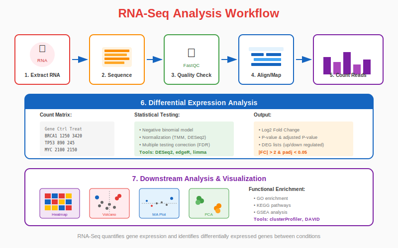
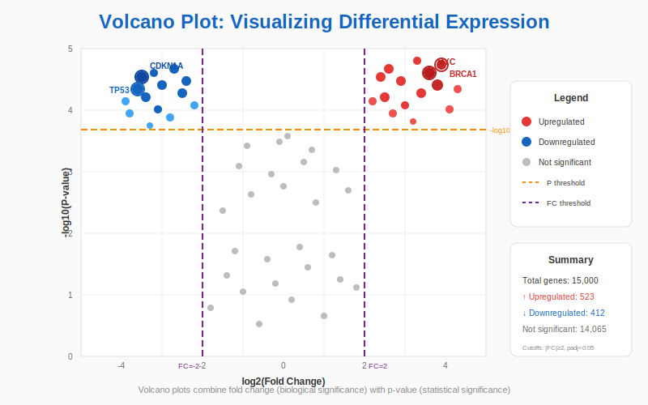

# Chapter 12: Transcriptomics: Analyzing Gene Expression (RNA-Seq)


<div class="download-slides">
📥 <a href="../slides/chapter-11.pptx" download>Download Lecture Slides (PPTX)</a>
</div>

## 12.1 What is the Transcriptome?

The genome is the cell's complete set of DNA—a static blueprint. However, not all genes in the blueprint are active at the same time. A brain cell and a liver cell have the same DNA, but they use different sets of genes to perform their specialized functions.

The **transcriptome** is the complete set of all RNA molecules (transcripts) in a cell at a specific moment. It's a dynamic snapshot of which genes are currently being expressed.

**Transcriptomics** is the study of this transcriptome, primarily to understand which genes are turned "on" or "off" under different conditions.

## 12.2 The RNA-Seq Workflow

<p align="center">
  
</p>

The dominant technology for studying the transcriptome is **RNA-Seq (RNA Sequencing)**. It leverages the NGS technology we learned about in Chapter 11.

1.  **RNA Extraction:** Isolate all RNA from a cell sample.
2.  **Reverse Transcription:** Convert the unstable RNA into more stable complementary DNA (cDNA).
3.  **NGS Sequencing:** Sequence the cDNA fragments to generate millions of short reads.
4.  **Mapping:** Align the sequencing reads to a reference genome to see which gene they came from.
5.  **Quantification:** Count how many reads mapped to each gene. This count is a proxy for the gene's expression level.

## 12.3 Mapping Reads to a Genome

Unlike genome assembly where we build the puzzle from scratch, in RNA-Seq we usually have a reference genome to work with. We use specialized aligners to map our RNA reads back to it.

However, there's a complication: **splicing**. In eukaryotes, genes are composed of exons (coding regions) and introns (non-coding regions). The introns are "spliced out" of the final mRNA. This means a read from a single mRNA molecule might map to two different exons in the genome, separated by a large intron.

Therefore, we need **splice-aware aligners** like **STAR** or **HISAT2** that can handle these large gaps.

## 12.4 Quantifying and Normalizing

Simply counting the reads per gene is not enough. A longer gene will naturally get more reads than a shorter one, and a sample sequenced to a greater depth will have more reads overall. We must **normalize** these counts.

Common units include:
*   **TPM (Transcripts Per Million):** Normalizes for both gene length and sequencing depth. This is the most common unit for comparing expression levels within a sample.
*   **FPKM/RPKM:** Older metrics, largely replaced by TPM.

## 12.5 Differential Expression Analysis

<p align="center">
  
</p>

The most common goal of an RNA-Seq experiment is to find **Differentially Expressed Genes (DEGs)**.

*   **Scenario:** You have two conditions: "Treated" vs "Control".
*   **Question:** Which genes are significantly up-regulated (more active) or down-regulated (less active) in the "Treated" group?

We use statistical tools like **DESeq2** or **edgeR** that take the raw counts, perform robust normalization, and calculate two key values for each gene:

1.  **Log2 Fold Change:** How much the gene's expression has changed between conditions. (e.g., +2 means 4x higher expression).
2.  **p-value (or adjusted p-value):** The statistical significance of this change.

The final result is often visualized as a **Volcano Plot**, which plots the fold change against the p-value, making it easy to see the most significant DEGs.

## 12.6 Bioinformatics in Action: A Conceptual Workflow

A full RNA-Seq analysis involves multiple command-line tools chained together. While the exact code is too complex for an introduction, the conceptual pipeline looks like this:

```bash
# Step 1: Index the reference genome for the aligner
hisat2-build genome.fa genome_index

# Step 2: Align reads from a sample to the genome
# -x: index, -U: unpaired reads, -S: output file
hisat2 -x genome_index -U sample1.fastq -S sample1.sam

# Step 3: Convert SAM to sorted BAM (a compressed, indexed format)
samtools view -bS sample1.sam | samtools sort -o sample1.sorted.bam

# Step 4: Count how many reads overlap with each gene
# -a: annotation file, -o: output counts
featureCounts -a genes.gtf -o counts.txt sample1.sorted.bam

# Step 5: Analyze the 'counts.txt' file in R using DESeq2
# (This step is performed in the R programming language, not the shell)
```

This workflow is repeated for every sample, and the final count files are combined for differential expression analysis.

## Summary

**Transcriptomics** provides a dynamic view of the genome in action. The **RNA-Seq** workflow allows us to quantify gene expression by sequencing cDNA and mapping the reads back to a genome. The ultimate goal is often to find **differentially expressed genes** between different conditions, giving us powerful insights into the molecular basis of disease, development, and cellular responses.

## 12.7 Modern Quantification Methods: Pseudoalignment and Transcript-Level Analysis

Newer tools perform very fast, accurate transcript quantification without full alignment. These are now standard for many RNA-Seq workflows:

- **Pseudoaligners / lightweight quantifiers:** `Salmon` and `Kallisto` map reads to a transcriptome index and produce transcript-level abundances quickly and with low memory.
- **Transcript-to-gene aggregation:** Use `tximport` (R) to import transcript-level estimates into gene-level counts for DE testing in `DESeq2` or `edgeR`.

Example: quantify with `salmon` (quasi-mapping mode):

```bash
# Build transcriptome index
salmon index -t transcripts.fa -i transcripts_index

# Quantify reads
salmon quant -i transcripts_index -l A \
  -1 sample_R1.fastq.gz -2 sample_R2.fastq.gz \
  -p 8 -o sample_salmon
```

## 12.8 Differential Expression and Downstream Analysis

- **DE tools:** `DESeq2` and `edgeR` remain standard for differential expression with appropriate normalization and experimental design specification.
- **Visualization:** PCA on normalized counts, heatmaps, and volcano plots help inspect results and batch effects.
- **Single-cell:** For single-cell RNA-Seq, specialized preprocessing is required: UMI handling, cell barcode parsing, doublet detection, and normalization. Tools: `CellRanger` (10x Genomics), `Scanpy`, `Seurat`.

## 12.9 Reproducible RNA-Seq Pipelines

Encode your pipelines using `Snakemake` or `Nextflow`, containerize tools, and include `MultiQC` to aggregate QC across samples. For large consortia projects, maintain metadata (sample sheets) and workflow parameter files to ensure provenance.