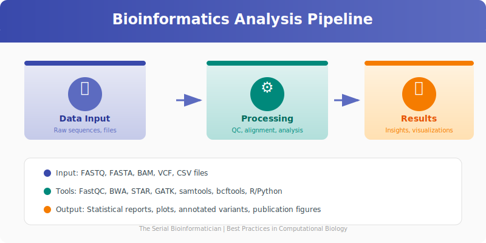

# Chapter 20: Multiomics Data Integration

## 20.1 The Power of Integration

Biological systems are complex and multilayered. A single "omic" layer—whether it's the genome, transcriptome, proteome, or metabolome—provides only a partial snapshot of the organism's state. **Multiomics data integration** combines these distinct layers to construct a holistic view of biological processes, revealing interactions and regulatory mechanisms that would be invisible in isolation.

<p align="center">
  
</p>

## 20.2 Challenges in Integration

Integrating these datasets is not straightforward due to:
*   **Heterogeneity:** Different data types (counts for RNA-Seq, intensities for Proteomics) have different distributions and noise profiles.
*   **Dimensionality:** The "Curse of Dimensionality" ($p \gg n$) is exacerbated when stacking datasets.
*   **Missing Data:** Samples might be missing from one layer but present in another.

## 20.3 Integration Strategies

There are three main approaches to integration:

### 1. Early Integration (Concatenation)
*   **Method:** Concatenate matrices from different omics into one large matrix.
*   **Pros:** Simple to implement.
*   **Cons:** Ignores the specific statistical properties of each data type; larger datasets can dominate the signal.

### 2. Late Integration (Ensemble)
*   **Method:** Analyze each omic layer separately (e.g., differential expression) and combine the lists of significant features or p-values at the end.
*   **Pros:** Easy to interpret; respects individual data distributions.
*   **Cons:** Misses correlations *between* layers (e.g., a gene is upregulated, but its protein is degraded).

### 3. Intermediate Integration (Joint Dimension Reduction)
*   **Method:** Use mathematical techniques to find latent variables (factors) that explain variance across multiple views simultaneously.
*   **Tools:** **MOFA+** (Multi-Omics Factor Analysis), **mixOmics** (sPLS, DIABLO).
*   **Pros:** Captures co-variation between layers; handles missing data well (MOFA).

## 20.4 Bioinformatics in Action: Multiomics with mixOmics (R)

Let's demonstrate an intermediate integration using the R package `mixOmics`. We will use sparse Partial Least Squares (sPLS) to find correlated features between Transcriptomics (mRNA) and Proteomics data.

```r
library(mixOmics)

# Simulated Data
# X: Transcriptomics (50 samples x 1000 genes)
# Y: Proteomics (50 samples x 500 proteins)
data(liver.toxicity)
X <- liver.toxicity$gene
Y <- liver.toxicity$clinic # Using clinical data as proxy for a second omic layer for demo

# 1. Sparse PLS (sPLS)
# Selects 50 genes and 10 clinical variables that covary
result.spls <- spls(X, Y, ncomp = 2, keepX = c(50, 50), keepY = c(10, 10))

# 2. Visualization
# Plot samples in the integrated subspace
plotIndiv(result.spls, group = liver.toxicity$treatment$Dose.Group, 
          pch = 16, ellipse = TRUE, legend = TRUE, title = 'sPLS: Genes vs Clinical')

# 3. Correlation Circle Plot
# Shows correlations between selected features from both datasets
plotVar(result.spls, cutoff = 0.7, title = 'Correlation Circle')

# 4. Network Visualization
# Visualizes the connections between the two layers
network(result.spls, comp = 1, cutoff = 0.6, 
        color.node = c("mistyrose", "lightcyan"),
        shape.node = c("rectangle", "circle"))
```

## 20.5 The Future: Single-Cell Multiomics

The frontier of integration is at the single-cell level (e.g., CITE-seq, which measures RNA and surface proteins in the same cell). Methods like **Seurat v4** allow for the "anchoring" of datasets to transfer labels and infer relationships at cellular resolution.

## Summary

Multiomics integration is the key to unlocking the genotype-phenotype map. By moving from single-layer analysis to integrated models like **MOFA** or **sPLS**, we can discover robust biomarkers and mechanistic pathways that drive complex diseases.

## 20.6 Batch Correction and Quality Control

Integrating data from multiple labs or runs requires careful batch correction:

- **ComBat / SVA:** Standard methods for expression data; ComBat-seq for counts.
- **Harmony / scVI:** For single-cell data integration and label transfer.
- **Caution:** Always visualize before and after correction (PCA, UMAP) and avoid removing real biological signal.

## 20.7 Recommended Multiomics Workflow

1. Harmonize sample IDs and metadata across layers.
2. Perform QC and normalization per layer.
3. Apply batch correction if needed.
4. Run joint dimension reduction (MOFA+, mixOmics).
5. Interpret factors biologically (enrichment, network mapping).
6. Validate top features in independent cohorts or with orthogonal assays.

---

**[End of Book]**